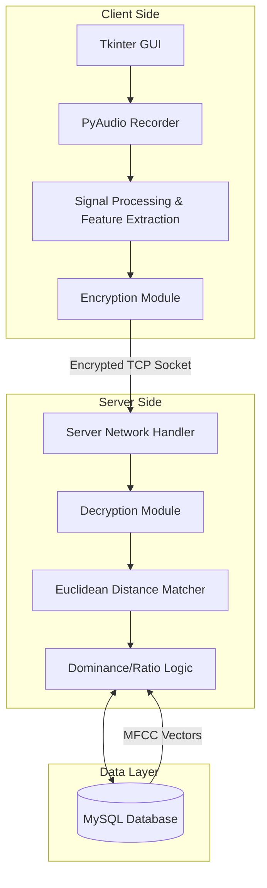

# Yahelizam - Secure Audio Recognition System

**Yahelizam** is a robust audio fingerprinting and recognition application. It utilizes spectral analysis to identify songs from short audio samples (recorded via microphone or uploaded as WAV files). The system features a client-server architecture secured by custom-implemented end-to-end encryption.


## The "Magic": How the Algorithm Works

Unlike simple waveform comparison, Yahelizam uses **content-based audio retrieval** operating in the frequency domain. This enables the system to recognize songs even when the volume differs or there is slight background noise.

### 1. Acoustic Feature Extraction (MFCCs)
The core of the recognition engine relies on **Mel-frequency cepstral coefficients (MFCCs)**.
* **Why MFCCs?** Raw audio contains too much data. MFCCs represent the short-term power spectrum of sound, effectively capturing the "timbre" or "color" of the audio, similar to how the human ear perceives sound.
* **Dimensionality Reduction:** Instead of sending the entire spectrogram, we calculate the **Mean** and **Variance** of the MFCC vectors across the time axis. This compresses a 5-second audio clip into a compact numerical signature (fingerprint).

### 2. Vector Quantization & Matching
The database stores these pre-computed MFCC signatures. When a user records a sample:
1.  The client computes the signature of the input audio.
2.  The server compares this signature against thousands of stored signatures using **Euclidean Distance**:
    $$d(p, q) = \sqrt{\sum_{i=1}^{n} (q_i - p_i)^2}$$
3.  The system identifies the "Nearest Neighbors" (the songs with the smallest geometric distance to the input).

## Security & Cryptography

* **End-to-End Encryption:** The application utilizes the `PyNaCl` library (Networking and Cryptography library) to secure the TCP socket connection.
* **Key Exchange:**
    * Upon connection, the Client and Server exchange Public Keys.
    * A secure box is created using the sender's Private Key and the receiver's Public Key.
* **Message Security:** Every packet sent over the network is encrypted using a unique number to prevent replay attacks.
* **Authentication:** User passwords are never stored in plain text. The database stores **MD5 hashes** of passwords, ensuring that even if the database is compromised, user credentials remain obfuscated.


## Architecture

The system is divided into three distinct layers: the **Client** (GUI & Signal Processing), the **Server** (Matching Engine), and the **Database** (Storage).



* ## Setup & Installation

### Prerequisites
* **Python 3.10+**
* **MySQL Server** installed and running locally.

### 1. Clone the Repository
Start by cloning the project to your local machine:
```bash
git clone https://github.com/yahelil/Shazam.git
cd Shazam
```
### 2. Install Dependencies
Install the required Python libraries using the provided requirements file:
```bash
pip install -r requirements.txt
```
### 3. Database Setup
1.  Open your MySQL client (e.g., Workbench or Command Line).
2.  Create a database named `mydatabase`.
3.  Update the credentials in `Database.py` (inside get_clients_database) to match your local MySQL configuration.
    * *Default User:* `root`
    * *Default Password:* `[Your Password]`
      
### 4. Populating the Database
Before running the client, you must ingest songs into the database so the system has something to match against:

1.  Run the database utility script:
    ```bash
    python Database.py
    ```
2.  Browse and select your `.wav` files.
3.  The system will automatically:
    * Split the audio into 5-second chunks.
    * Calculate the MFCC fingerprints.
    * Store the signatures in MySQL.

## Running the Application

**Step 1: Start the Server**
Open a terminal and run the server to start listening for connections:
```bash
python Server.py
```
The server will initialize on `0.0.0.0:2487.`

**Step 2: Start the Client**
Open a new terminal window (keep the server running) and launch the GUI:
```bash
python Client.py
```
The application window will open. You can now Sign Up, Sign In, and start recording.

1.  **Authentication:**
    * Click **Sign Up** to create a new user account.
    * Once registered, click **Sign In** to access the main dashboard.

2.  **Recognition Modes:**
    * **Live Recording:** Press **"Record 2 seconds"** to capture audio directly from your microphone. Ideally, play the music on a separate device near your mic.
    * **File Upload:** Press **"Use Prerecorded Sample"** to upload a specific `.wav` file for testing against the database.

3.  **Understanding Results:**
    * **Match Found:** If the system finds a dominant match (low distance), it will display the **Song Name** and the **Distance Score**.
    * **Ambiguous Match:** If the audio is unclear or similar to multiple tracks, the system will list the **Top 3 Candidates** instead of guessing.
